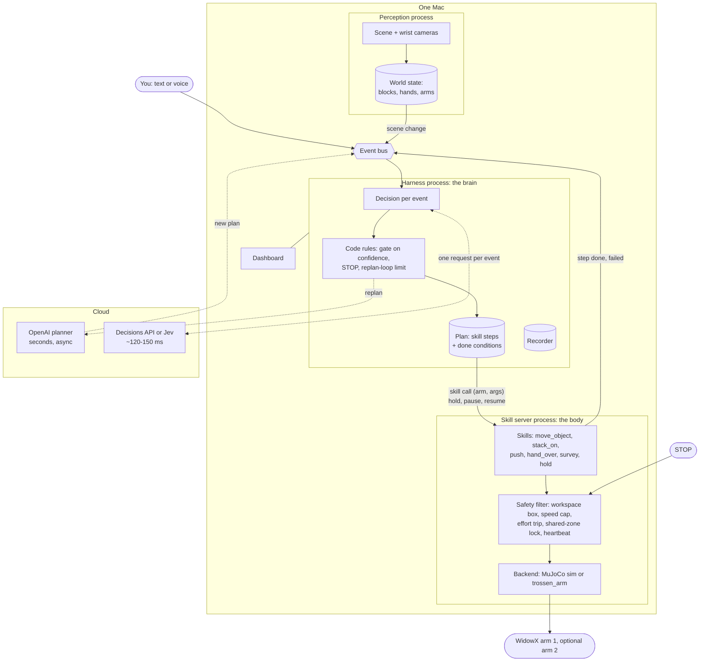

# Architecture

What we're building toward, on one or two WidowX AI arms. The design rationale is in `docs/v2.md`;
the spikes that de-risk it are in `docs/harness-spikes.md`.

## Parts

Everything runs on one Mac; the WidowX needs no real-time box.

1. **Perception process.** Cameras to a world state: blocks, hands, arm poses. A change the robot
   didn't cause becomes an event. In sim, the world state comes from MuJoCo directly.
2. **Harness process (the brain).** The v2 design. Events (user text, scene change, step done or
   failed, new plan) go on a bus; each gets one decision request with three groups (right now,
   in-plan fix, who handles it). Code combines the answers, gates on confidence and applies the rules
   (STOP, models can only pause, replan-loop limit). An OpenAI model writes and fixes the plan
   asynchronously; a plan is skill calls plus done conditions. A recorder logs everything.
3. **Robot server process (the body).** Motor skills: `move_object`, `stack_on`, `push`,
   `hand_over`, `survey`, `hold`. Under them a safety filter (workspace box, speed cap, effort trip,
   shared-zone lock, heartbeat), and under that a backend: MuJoCo sim or the real `trossen_arm`
   driver.
4. **Cloud.** The decision model (OpenAI's Decisions API or Jev, ~120-150 ms) and the planner (an
   OpenAI model, seconds).

## Hardware-agnostic: a protocol, not a library

The brain never knows which robot it drives. Each robot (sim WidowX, the bay's WidowX pair, a Panda,
a YAM) runs its own **robot server** speaking one protocol, shaped like MCP:

- **Manifest** (MCP `initialize` + `tools/list`): the arms with their workspace, gripper limits and
  base frame; the skills offered, each with a JSON schema for its arguments. The planner's output
  schema is generated from the manifest, so a robot that can't `hand_over` is never asked to.
- **Tools:** `start(arm, skill, args)`, `hold`, `pause`, `resume`, `retarget`, `stop`, `heartbeat`.
- **Resources:** the world state; each running skill's status with the literal phase text the
  decision loop reads.
- **Notifications:** skill done or failed, safety trip, scene change, heartbeat lost.

Skill granularity is the protocol boundary. The policy inside a skill (10-100 Hz) and the motor loop
(~1 kHz) never cross it. Units are metres and seconds; frames are declared in the manifest.

The interface is `experiments/skills_sim/protocol.py` during the spikes (in-process Python, each
method mapped to its MCP counterpart) and becomes an MCP server over stdio or HTTP at K6. The
planner LLM does not call tools directly: it emits a plan the harness executes, so the decision loop
and the safety rules always sit between the model and the robot.

## Seams

- **Robot protocol** (above): the same surface fronts sim, the real arm, a second arm, another
  make of arm and, later, a learned policy behind a skill.
- **Arm backend:** end-effector goal (position, pitch, yaw), speed cap and gripper width in; a
  snapshot out. Sim and real implement it.
- **World state:** objects with id, label, position, and who holds or has claimed them; hands; arm
  poses.
- **Decision backend:** questions in, answers with confidence out. Jev or the Decisions API.
- **Planner:** task plus world state in, a strict-JSON plan or plan diff out.

## Choices

1. Skills are scripted motor routines; reasoning stays in the LLM. A learned policy can replace a
   skill behind the same API later.
2. Harness and skill server are separate processes; safety lives in the skill server, out of reach
   of any model or harness bug.
3. One decision request per event with three question groups. The Decisions API is the default; Jev
   stays swappable.
4. The planner runs alongside; meanwhile the arm carries on or holds, as the right-now answer says.
5. Two arms: one harness drives both through one skill server, which owns the shared-zone lock. Two
   brains (two harnesses, one shared world state) come later.
6. Sim first, with ground-truth positions, before camera perception.
7. Code layout (proposed): e12v2's core moves into `src/robojev` as the new brain; v1's motion code
   (`Mover`, effort watchdog, IK) is reused inside the skill server; v1's per-tick primitives and
   brain retire.

## Skills and policies

A **policy** maps what the robot senses now to its next action, run in a loop. It can be hand-written
(inverse kinematics toward a target) or learned (a network trained from demonstrations or trial and
error; a VLA is a learned policy that reads images and an instruction).

A **skill** is a named, limited action with a contract: inputs (`move_object(block 5, slot 2)`),
preconditions, done or failed with a reason, and safe interrupt points (hold, pause, resume,
re-target). Inside each skill is a policy; ours start hand-written and read positions from the world
state each tick. The planner chooses which skills run in what order; the decision loop adapts that
as things happen. Recorded runs of the hand-written skills are the training data for learned ones.

| Layer | Decides | How often | Ours |
|---|---|---|---|
| Planner | Which skills, in what order | On a task or correction (seconds) | OpenAI model |
| Decision loop | Carry on, hold, fix, replan | Every event (~150 ms) | Decisions API / Jev |
| Skill | The next arm position | 10-100 times a second | Hand-written, learned later |
| Motor controller | Motor currents | ~1 kHz | Inside the arm |

Not decided yet: the demo script, speech input, learned policies.
