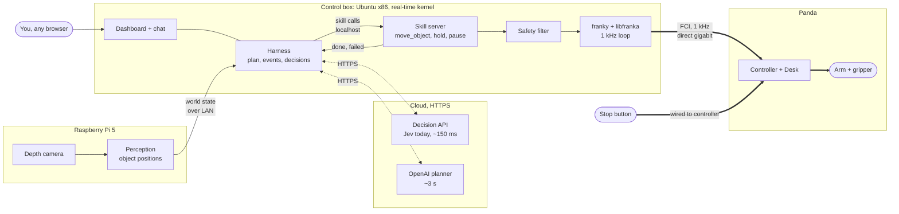
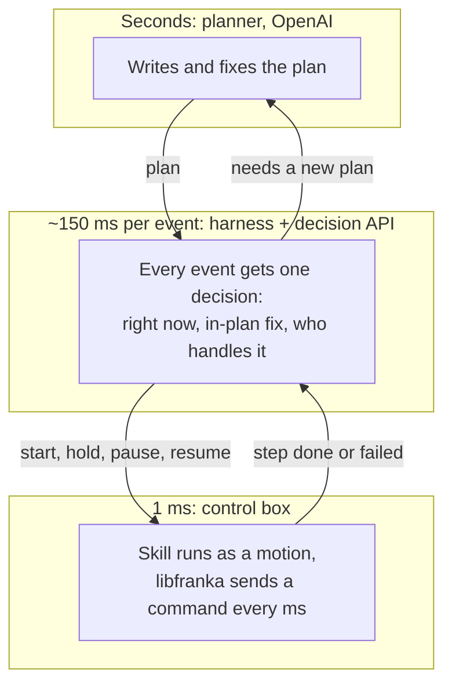
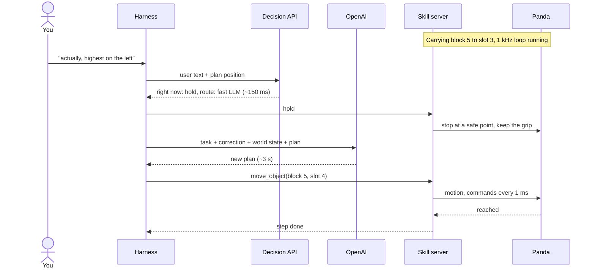

# Panda setup: control box + Raspberry Pi 5

How to run robojev on a Franka Emika Panda for the showcase. Check the parts marked **check** against
the robot before relying on them.

## The constraint that shapes everything

The Panda is driven through FCI, a 1 kHz control loop over Ethernet, using **libfranka**. libfranka
officially runs only on **Ubuntu (amd64) with a real-time (PREEMPT_RT) kernel**. It does not run on
macOS, and ARM64 (the Pi) is not officially supported. So the MacBook can't talk to the arm directly.

The **Panda** (not FR3) needs **libfranka 0.9.x**. Versions 0.10 and later support FR3 only. Match the
exact version to the robot's system image using Franka's compatibility table. **check**

## Who does what

| Machine | Runs |
|---|---|
| Control box | Everything on demo day, as separate processes: the harness (`experiments/e12v2/core`) with its LLM and decision calls, the dashboard, and a small **skill server** on libfranka + a Python binding that runs skills at 1 kHz and reports done/failed |
| MacBook | Development and the MuJoCo sim of the Panda; on demo day, just a browser on the dashboard |
| Robot | Panda arm + controller; Desk web UI |
| Pi 5 | See below: the control box itself (risky) or the camera host (recommended) |

The harness is light: it waits on events and HTTPS calls. On the control box it talks to the skill
server over localhost, so there's one less machine and no Wi-Fi hop on demo day. It must stay off the
core the 1 kHz loop runs on. The control box needs two network links: the dedicated cable to the
robot, and Wi-Fi or a second port for the internet. The skill server keeps its network interface, so
the harness can still run on the MacBook during development (sim or real arm).

The harness and the skill server stay separate processes, joined by a thin local socket (the skills,
plus pause, resume, stop and a heartbeat). The skill server can then run at real-time priority, keep
the arm safe if the harness crashes (it holds when the heartbeat stops), and keep the safety filter
out of the harness's reach. The same interface fronts the sim, the Panda, a YAM or a learned policy.

## How it fits together

### The machines and the wires

Option A on demo day: the Pi hosts the camera, and an x86 box runs the harness and drives the arm.
Thick lines are wired. Only the link from the control box to the controller is real-time.

### Three loops, three speeds

Each loop only talks to the one next to it. A slow answer above never stalls the loop below: the arm
carries on or holds while the planner thinks.

### A correction, end to end

## Where the Pi 5 fits

**Option A (recommended): Pi = camera host, x86 mini-PC = control box.** The Pi streams depth/RGB and
object positions to the harness on the control box; any Ubuntu amd64 machine with gigabit Ethernet runs libfranka. This is
the supported path and the safest bet for a live demo.

**Option B: Pi = control box.** Ubuntu 24.04 for Pi + a PREEMPT_RT kernel + libfranka 0.9.x built from
source. It may work, but it's unsupported, and a missed 1 kHz deadline stops the arm with a
communication error mid-demo. If you go this way, run libfranka's `communication_test` for several
minutes and accept only when it reports almost no lost packets. **check**

## Steps

1. **Robot.** Power on, then open Desk in a browser at the robot's IP. Note the system version
   (Settings → Dashboard). Unlock the joints. On system 4.2.0 or later, activate FCI in Desk.
2. **Network.** Plug the control box straight into the controller's **control** Ethernet port (not the
   arm base), gigabit, and give it a static IP on the robot's subnet. Connect the control box, Pi
   and MacBook on a second network (Wi-Fi or a switch) that also reaches the internet.
3. **Control box.** Ubuntu 22.04 amd64 + PREEMPT_RT kernel. Build libfranka at the version from the
   table (0.9.x), set real-time limits for your user, then run `communication_test <robot-ip>`.
4. **Binding.** Install **franky** or **panda-py** built against that libfranka version. Both publish
   builds for older libfranka versions on their GitHub releases; the default PyPI wheel targets a newer
   libfranka. **check**
5. **Skill server.** A small service on the control box that exposes the v2 skills (`move_object`,
   `hand_over`, `stack_on`, `push`, `survey`, `hold`) plus `pause`, `resume` and `stop`, built on franky
   motions with Cartesian impedance and force limits. The safety filter runs here, next to the arm.
6. **Harness.** Develop on the MacBook against the MuJoCo Panda (`franka_emika_panda` from MuJoCo
   Menagerie, native on macOS), then point it at the skill server. For the demo, run it on the control
   box in its own process, off the control-loop core.
7. **Camera.** Mount and calibrate the camera to the robot base (hand-eye or a fixed marker), so world
   state is in robot coordinates.

## Order of work

0. The discovery spikes below.
1. Sim: the e12v2 core on MuJoCo Panda on the MacBook, with the same skill interface the server will
   expose.
2. Control box: `communication_test` passes; franky moves the arm between two poses.
3. Skill server: the same skill calls drive the real arm with no camera (fixed block positions).
4. Camera on the Pi; perception events into the harness.
5. Move the harness onto the control box; run the whole demo from there.
6. Rehearse the headline correction; keep the physical stop button in hand.

## Discovery spikes

Run these before building. Each one is small, and each answers a question that could change the plan.
Most need the robot; S5 and S8 don't.

| # | Question | How | Pass when | Blocks |
|---|---|---|---|---|
| S1 | Which libfranka does this Panda need, and is FCI on? | Read the system version in Desk; check the compatibility table; activate FCI | Version pinned, FCI active | Everything on the arm |
| S2 | Does an x86 control box hold 1 kHz? | RT kernel, libfranka 0.9.x, `communication_test` for 10 min, then again with the harness and a CPU load running | Almost no lost packets, no aborts | Option A |
| S3 | Can the Pi 5 hold 1 kHz instead? | Same as S2 on the Pi with a PREEMPT_RT kernel, one core isolated | Same bar as S2 | Option B |
| S4 | Does franky (or panda-py) work against 0.9.x, and can it stop a motion mid-way and hold? | Install the matching build; move between two poses 50 times; interrupt a motion and hold; open and close the gripper | All 50 moves clean; hold within ~100 ms, grip kept | The skill server |
| S5 | Does the e12v2 core run unchanged against a MuJoCo Panda? | Menagerie `franka_emika_panda` behind the skill interface on the MacBook | Sorting episode completes in sim | The skill interface |
| S6 | Does the skill server's watchdog hold the arm when the harness goes quiet? | Kill the harness mid-motion | Arm holds within the timeout | Demo safety |
| S7 | Can the Franka Hand reliably pick and place the demo blocks? | 20 picks and places at fixed positions | 19 of 20 or better | Choice of blocks |
| S8 | Does the camera work on the Pi, and can it see what we need? | Camera driver on the Pi (ARM64); frame rate; depth on small blocks; read block numbers locally or with OpenAI vision | Positions within ~1 cm, numbers read right, under ~300 ms per update | Perception |
| S9 | Is camera-to-robot calibration good enough to grasp from? | Hand-eye or a fixed marker; touch the gripper to 10 known points | Error under ~1 cm | Picks from vision |
| S10 | Can perception see a hand reaching in fast enough to pause? | Hand detection on the camera feed, timed from entry to pause | Pause decision within ~500 ms of the hand entering | The walk demo |
| S11 | What do the arm's own collision reflexes do, and how do we recover? | Bump the arm gently; press the stop button; recover in software | Recovery without a reboot | Demo flow |
| S12 | Can OpenAI's Decisions API replace Jev, and can it look at camera frames itself? | Put it behind the decision interface; replay the e12v2 scenarios and compare answers, confidence and latency with Jev; then add a camera frame to scene-change decisions | Matches Jev's answers and the 0.8 gate works on its confidence; latency with an image fits the event loop | Swapping out Jev; may shrink S8 and S10 |
| S13 | Is the venue's network good enough? | OpenAI and decision-API latency from the venue, or a hotspot; plan for no internet | Planner p95 under ~8 s, decision p95 under ~400 ms | The live demo |

Order: S1, then S2 and S4 (with S3 if the Pi has to drive), S5 and S8 in parallel off the robot, then
the rest.

## Open questions

- Panda system version (sets the libfranka version).
- Is there an x86 Ubuntu machine for the control box, or must the Pi do it?
- What is "Astra": the Orbbec Astra depth camera (a natural fit for the Pi) or something else?
- OpenAI's Decisions API (`POST /v1/decisions`, launched October 2026, in limited preview): what
  secondhand sources say so far is choice, noul and score questions like Jev, per-option probabilities
  plus a separate confidence field, and up to 128 inline base64 images per request. Unverified: we
  haven't read the official docs or got access yet. **check**
- YAM arm: kept in mind; the skill server interface should cover it too.

## Sources

- [libfranka docs](https://docs.ros.org/en/humble/p/libfranka/) and
  [changelog](https://docs.ros.org/en/humble/p/libfranka/standard_docs/CHANGELOG.html)
- [Franka FCI documentation](https://support.franka.de/docs/index.html) and
  [compatibility](https://support.franka.de/docs/compatibility.html)
- [franky](https://pypi.org/project/franky-panda/0.11.0/), [panda-py](https://pypi.org/project/panda-python)
