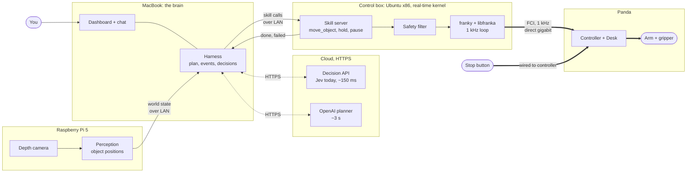
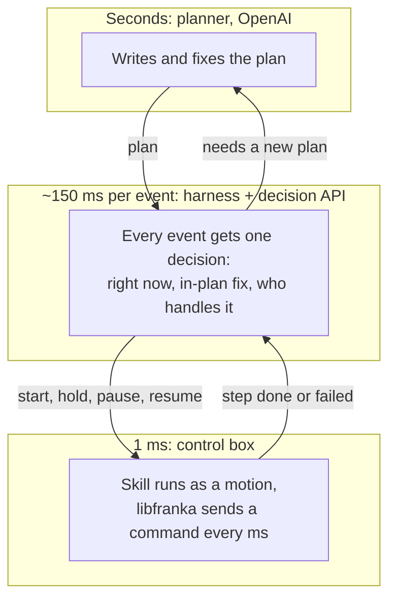

# Panda setup: MacBook + Raspberry Pi 5

How to run robojev on a Franka Emika Panda for the showcase. Check the parts marked **check** against
the robot before relying on them.

## The constraint that shapes everything

The Panda is driven through FCI, a 1 kHz control loop over Ethernet, using **libfranka**. libfranka
officially runs only on **Ubuntu (amd64) with a real-time (PREEMPT_RT) kernel**. It does not run on
macOS, and ARM64 (the Pi) is not officially supported. So the MacBook can't talk to the arm directly.

The **Panda** (not FR3) needs **libfranka 0.9.x**. Versions 0.10 and later support FR3 only. Match the
exact version to the robot's system image using Franka's compatibility table. **check**

## Who does what

| Machine | Runs |
|---|---|
| MacBook | The brain: harness (`experiments/e12v2/core`), LLM and decision calls, dashboard, MuJoCo sim of the Panda |
| Control box | libfranka + a Python binding + a small **skill server**: takes `move_object(...)` etc. over the network, runs it at 1 kHz, reports done/failed |
| Robot | Panda arm + controller; Desk web UI |
| Pi 5 | See below: the control box itself (risky) or the camera host (recommended) |

The MacBook and the robot never need low latency between them: skills are seconds long, and the
decision loop is event-driven at ~150 ms. Only the control box ↔ robot link is hard real-time.

## How it fits together

### The machines and the wires

Option A: the Pi hosts the camera, and an x86 box drives the arm. Thick lines are wired. Only the link
from the control box to the controller is real-time.

### Three loops, three speeds

Each loop only talks to the one next to it. A slow answer above never stalls the loop below: the arm
carries on or holds while the planner thinks.

### A correction, end to end

## Where the Pi 5 fits

**Option A (recommended): Pi = camera host, x86 mini-PC = control box.** The Pi streams depth/RGB and
object positions to the MacBook; any Ubuntu amd64 machine with gigabit Ethernet runs libfranka. This is
the supported path and the safest bet for a live demo.

**Option B: Pi = control box.** Ubuntu 24.04 for Pi + a PREEMPT_RT kernel + libfranka 0.9.x built from
source. It may work, but it's unsupported, and a missed 1 kHz deadline stops the arm with a
communication error mid-demo. If you go this way, run libfranka's `communication_test` for several
minutes and accept only when it reports almost no lost packets. **check**

## Steps

1. **Robot.** Power on, then open Desk in a browser at the robot's IP. Note the system version
   (Settings → Dashboard). Unlock the joints. On system 4.2.0 or later, activate FCI in Desk.
2. **Network.** Plug the control box straight into the controller's **control** Ethernet port (not the
   arm base), gigabit, and give it a static IP on the robot's subnet. Put the MacBook and Pi on a
   second network (Wi-Fi or a switch) to the control box.
3. **Control box.** Ubuntu 22.04 amd64 + PREEMPT_RT kernel. Build libfranka at the version from the
   table (0.9.x), set real-time limits for your user, then run `communication_test <robot-ip>`.
4. **Binding.** Install **franky** or **panda-py** built against that libfranka version. Both publish
   builds for older libfranka versions on their GitHub releases; the default PyPI wheel targets a newer
   libfranka. **check**
5. **Skill server.** A small service on the control box that exposes the v2 skills (`move_object`,
   `hand_over`, `stack_on`, `push`, `survey`, `hold`) plus `pause`, `resume` and `stop`, built on franky
   motions with Cartesian impedance and force limits. The safety filter runs here, next to the arm.
6. **MacBook.** Run the harness against the MuJoCo Panda first (`franka_emika_panda` from MuJoCo
   Menagerie, native on macOS), then point it at the skill server.
7. **Camera.** Mount and calibrate the camera to the robot base (hand-eye or a fixed marker), so world
   state is in robot coordinates.

## Order of work

1. Sim: the e12v2 core on MuJoCo Panda on the MacBook, with the same skill interface the server will
   expose.
2. Control box: `communication_test` passes; franky moves the arm between two poses.
3. Skill server: the same skill calls drive the real arm with no camera (fixed block positions).
4. Camera on the Pi; perception events into the harness.
5. Rehearse the headline correction; keep the physical stop button in hand.

## Open questions

- Panda system version (sets the libfranka version).
- Is there an x86 Ubuntu machine for the control box, or must the Pi do it?
- What is "Astra": the Orbbec Astra depth camera (a natural fit for the Pi) or something else?
- Docs for the new decisions API, to put behind the same decision interface as Jev.
- YAM arm: kept in mind; the skill server interface should cover it too.

## Sources

- [libfranka docs](https://docs.ros.org/en/humble/p/libfranka/) and
  [changelog](https://docs.ros.org/en/humble/p/libfranka/standard_docs/CHANGELOG.html)
- [Franka FCI documentation](https://support.franka.de/docs/index.html) and
  [compatibility](https://support.franka.de/docs/compatibility.html)
- [franky](https://pypi.org/project/franky-panda/0.11.0/), [panda-py](https://pypi.org/project/panda-python)
