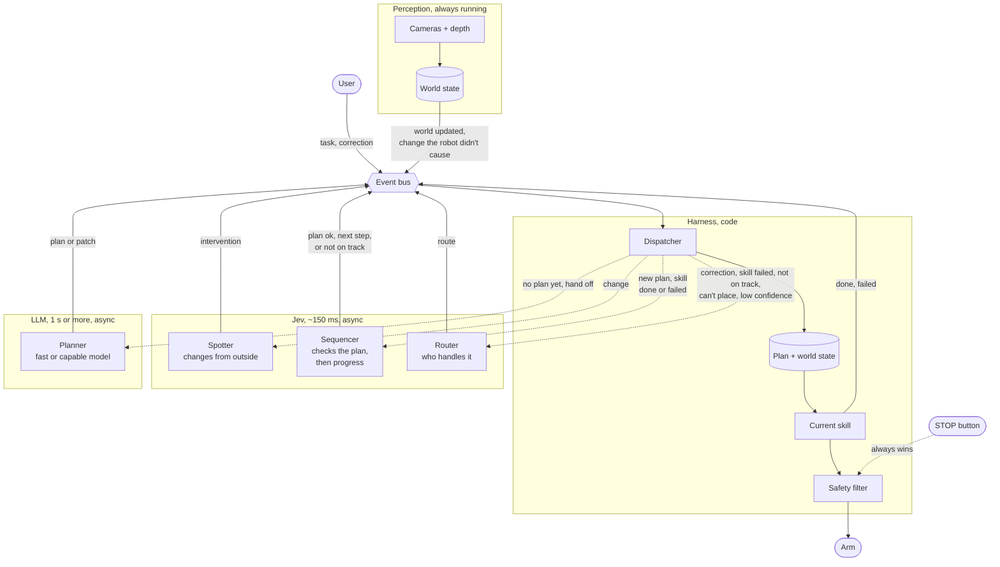
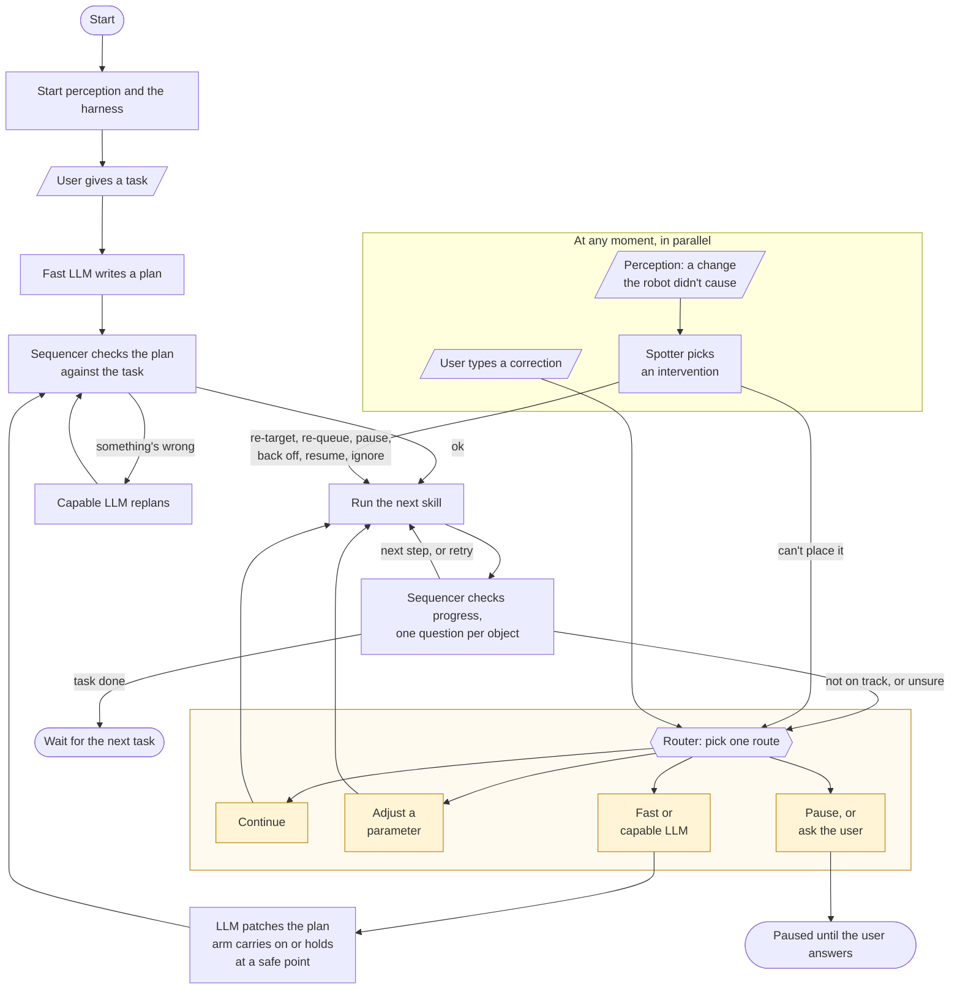
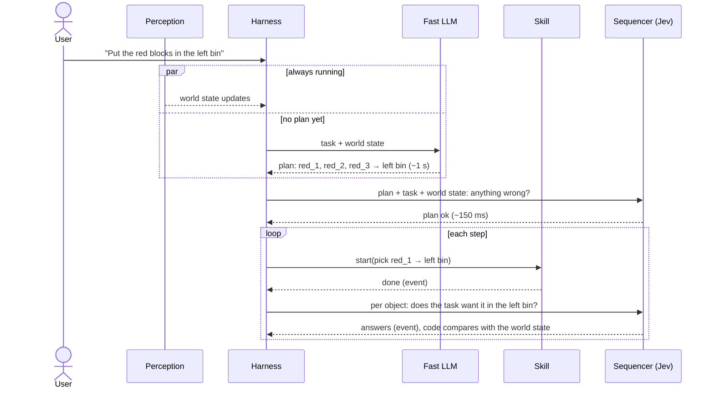
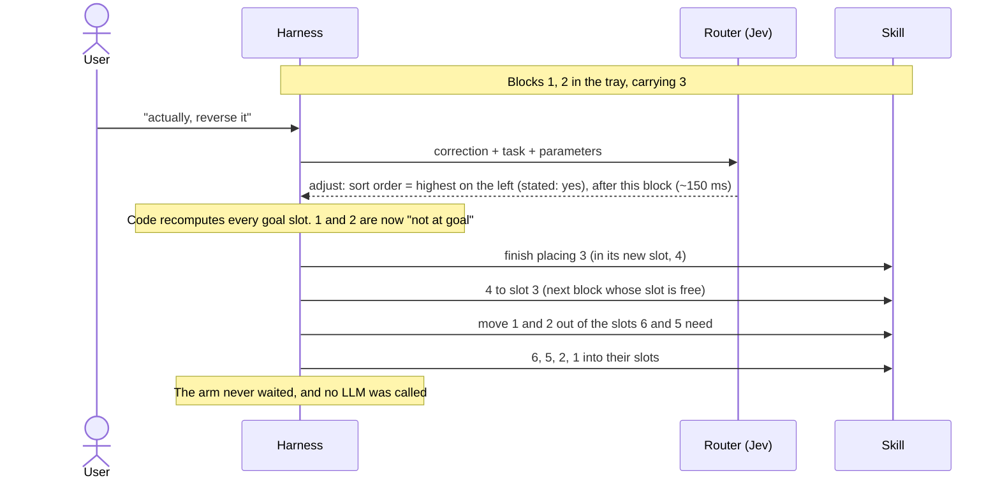
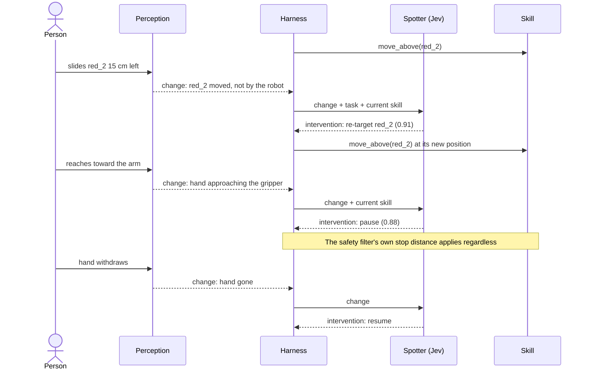
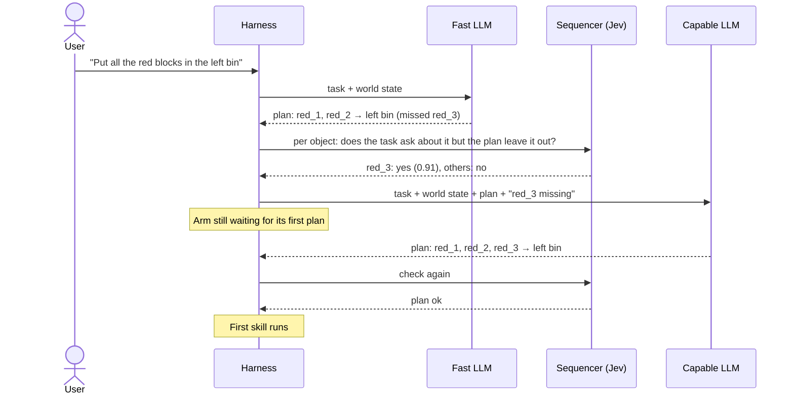
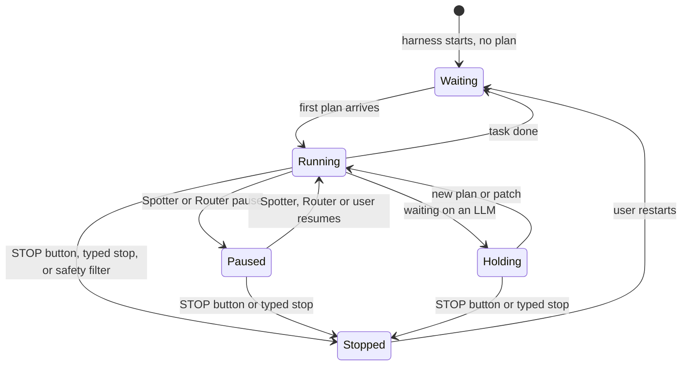

# v2 diagrams

Companion to `docs/v2.md`. GitHub renders these.

## 1. Architecture: the event bus

Perception, the user and skills put events on a bus. The harness takes each event, asks the right
layer (async), and applies the answer. Only the harness moves the arm, and perception sees the result.

## 2. Workflow: start-up and execution

The same loop with the bus left out, read top to bottom. The main path runs one skill at a time; the
box on the side can fire at any moment, in parallel with it.

## 3. Start-up and the normal cycle, in time

Perception and the harness start first. With no plan, the harness asks the fast LLM for one; the
first skill runs as soon as it arrives, and everything after that is event-driven.

## 4. Headline demo: "actually, reverse it"

The task is "line the numbered blocks up in the tray, lowest on the left". The correction changes the
final arrangement, so the sort order parameter flips. Jev maps the words onto the parameter within
~150 ms; code works out every move from there, including the blocks already placed. No LLM.

## 5. Walk: someone moves the target, then reaches in

Perception flags changes the robot didn't cause; the Spotter decides what each one means.

## 6. A plan that misses something

Nothing outside changed: the fast LLM's plan left out a block that was half hidden behind the bin.
The Sequencer's check catches it before anything moves; the per-object check after each skill is
the backstop if it slips through.

## 7. What the arm is doing

Only the harness moves the arm between these states. A model can pause it; only the STOP button,
"stop" typed by the user, or the safety filter stops it.

