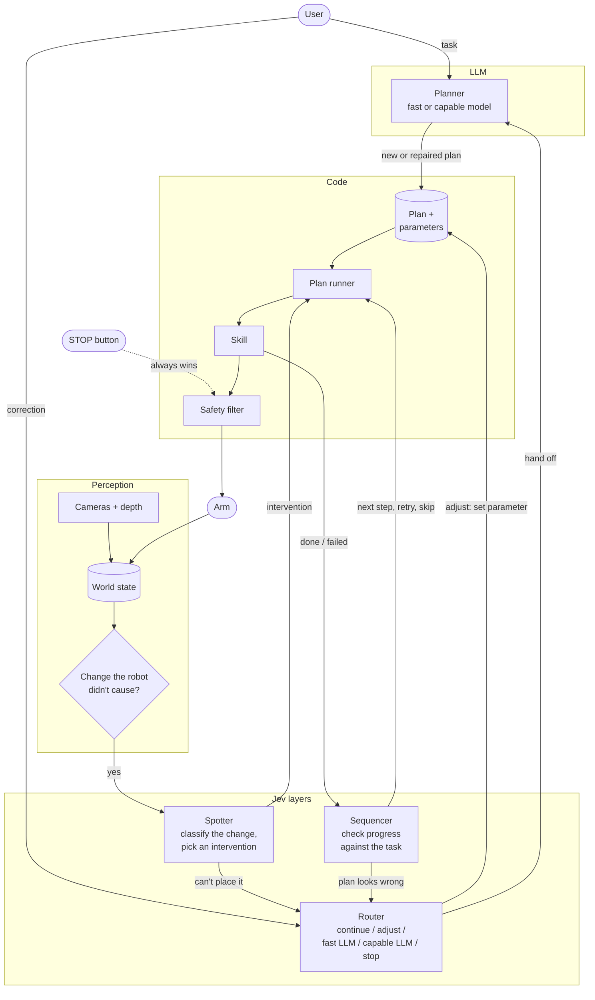
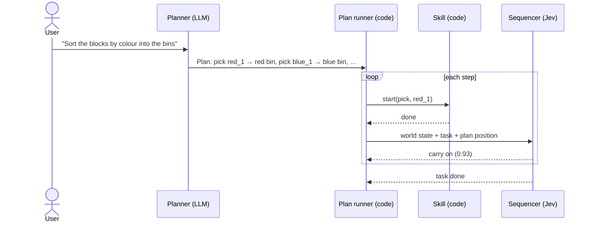
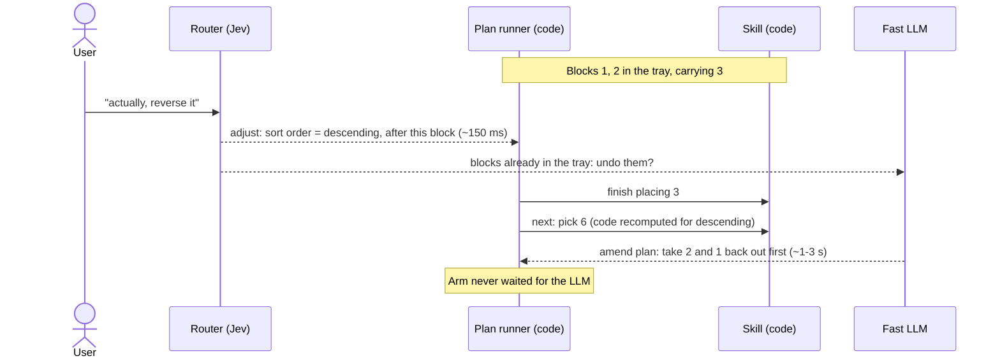
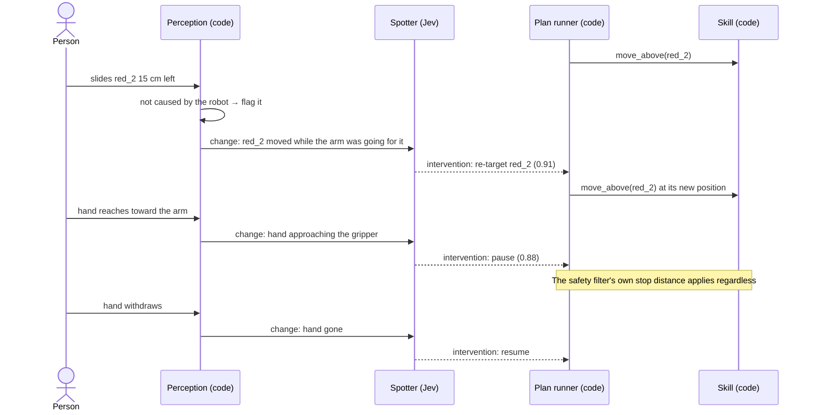
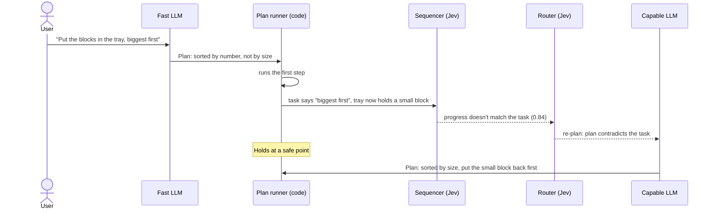
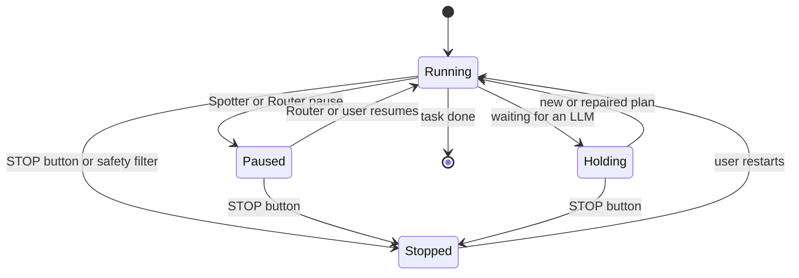

# v2 diagrams

Companion to `docs/v2.md`. GitHub renders these.

## 1. The loop

Who wakes up on what, and where decisions go. Jev layers run only when their trigger fires.

## 2. Crawl: the normal cycle

No surprises: the plan runs and the Sequencer checks each step against the task.

## 3. Headline demo: "actually, reverse it"

The fast path acts within ~150 ms; the LLM handles only the ambiguous part, in parallel.

## 4. Walk: someone moves the target

Perception notices a change the robot didn't cause; the Spotter decides what it means.

## 5. A wrong plan, caught by the Sequencer

Nothing outside changed: the fast model's plan was wrong, and checking against the task catches it.

## 6. What the arm is doing

Only code moves the arm between these; models can request a pause but not a hard stop.

