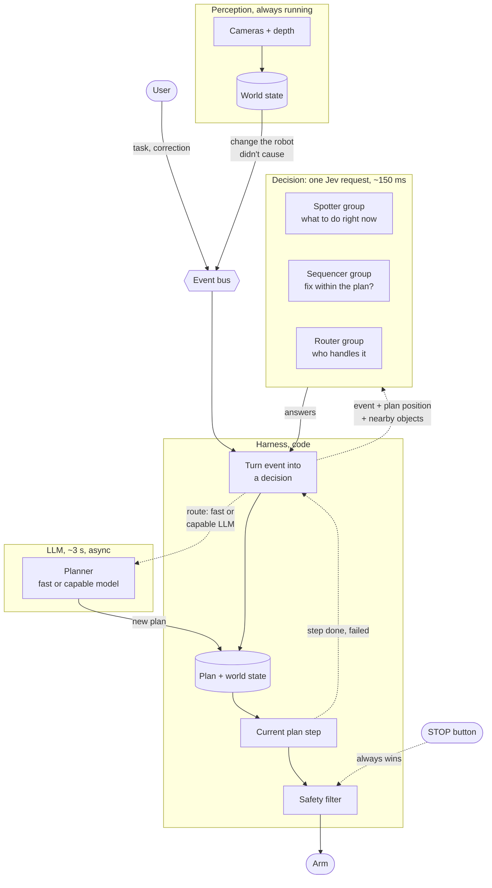
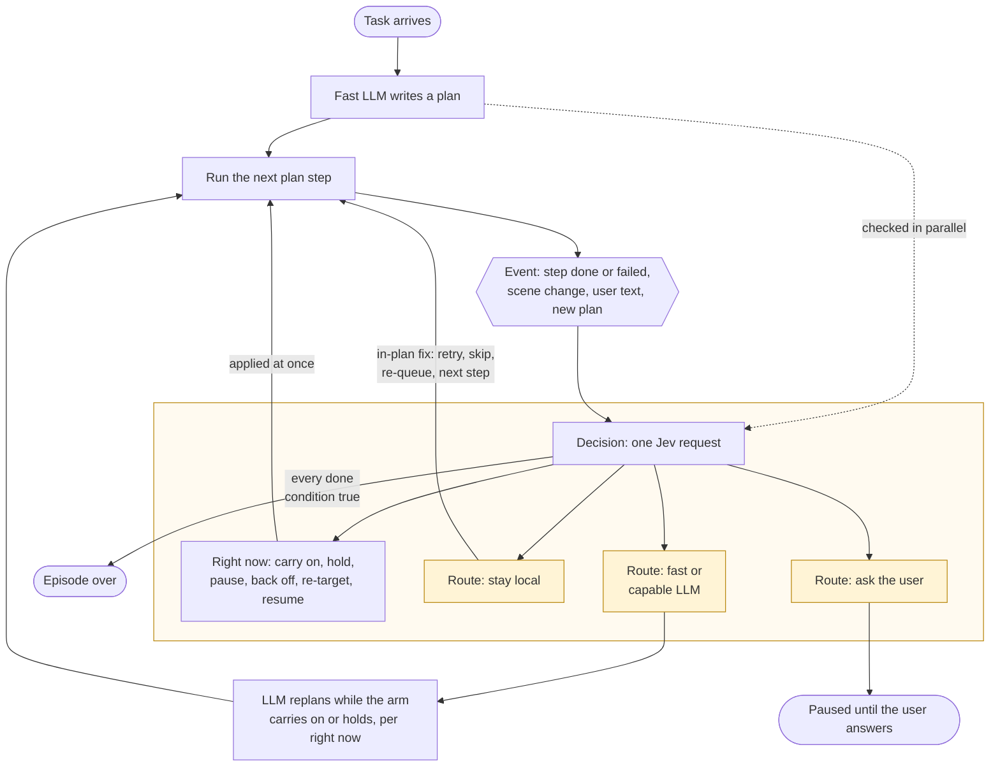
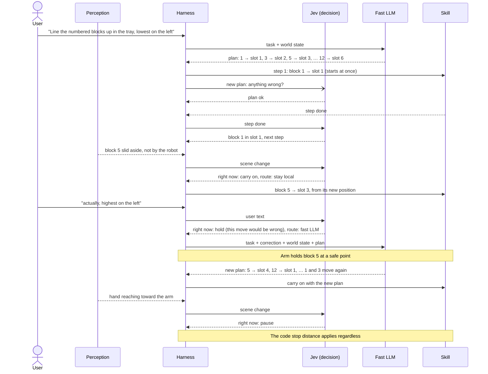
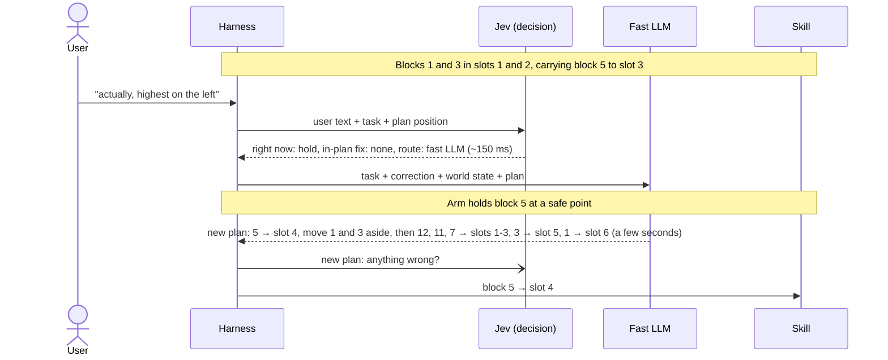
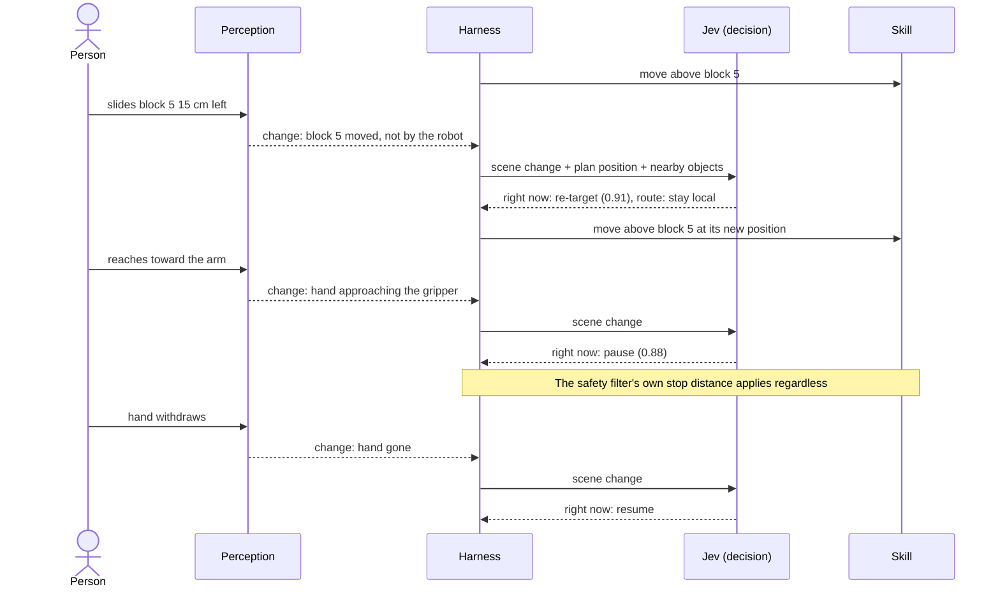
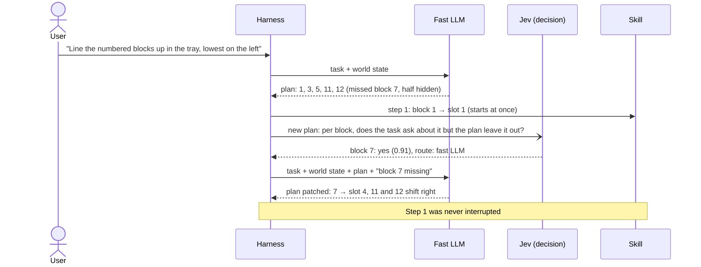
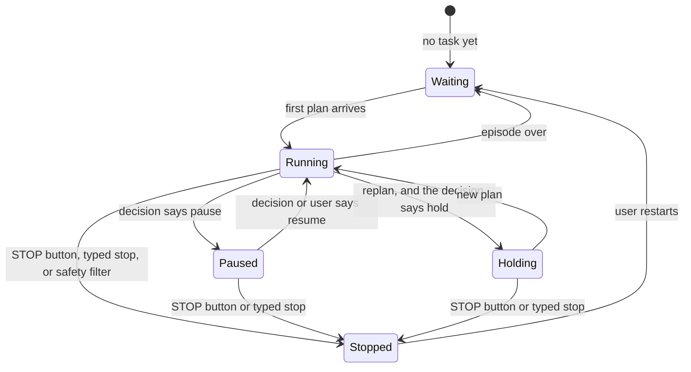

# v2 diagrams

Companion to `docs/v2.md`. GitHub renders these.

## 1. Architecture

Perception and the user put events on a bus, and skills report back to the harness. For each event the harness sends one Jev
request (the decision) and applies the answers. LLM calls run alongside; only the harness moves the
arm.

## 2. An episode

The same loop read top to bottom. Every event goes through the same decision; the route decides
whether it stays local or goes to an LLM.

## 3. An episode in time

"Line the numbered blocks up in the tray, lowest number on the left" (blocks 1, 3, 5, 7, 11, 12),
with a moved block, a correction and a hand.

## 4. Headline demo: a correction mid-run

Jev reads the correction in ~150 ms and decides whether the arm carries on or holds; the LLM works
out the new order. Nothing about the correction was prepared in advance.

## 5. Walk: someone moves a block, then reaches in

Changes from outside go through the same decision; the right-now answer does the work.

## 6. A plan that misses something

The plan check runs in parallel with the first step. When it finds a problem, that is just another
decision routed to the LLM.

## 7. What the arm is doing

Only the harness moves the arm between these states. A model can pause it; only the STOP button,
"stop" typed by the user, or the safety filter stops it.

