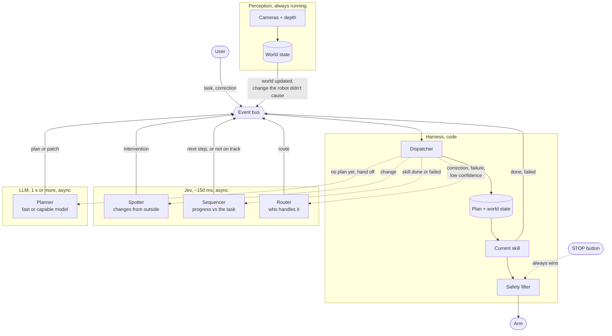
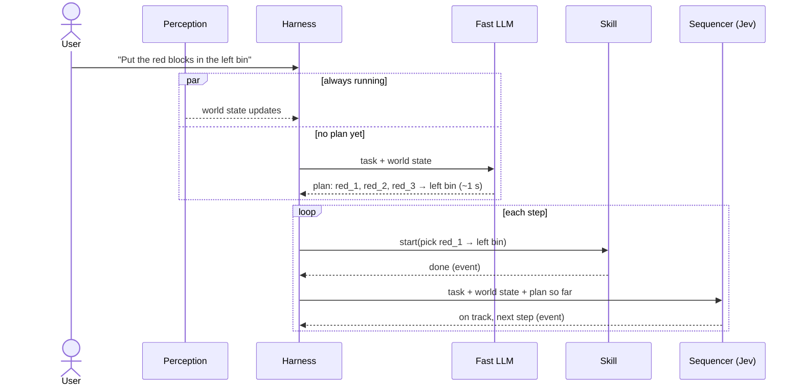
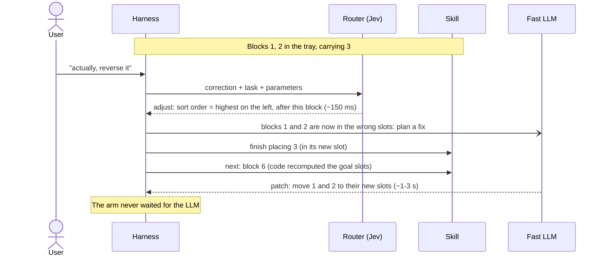
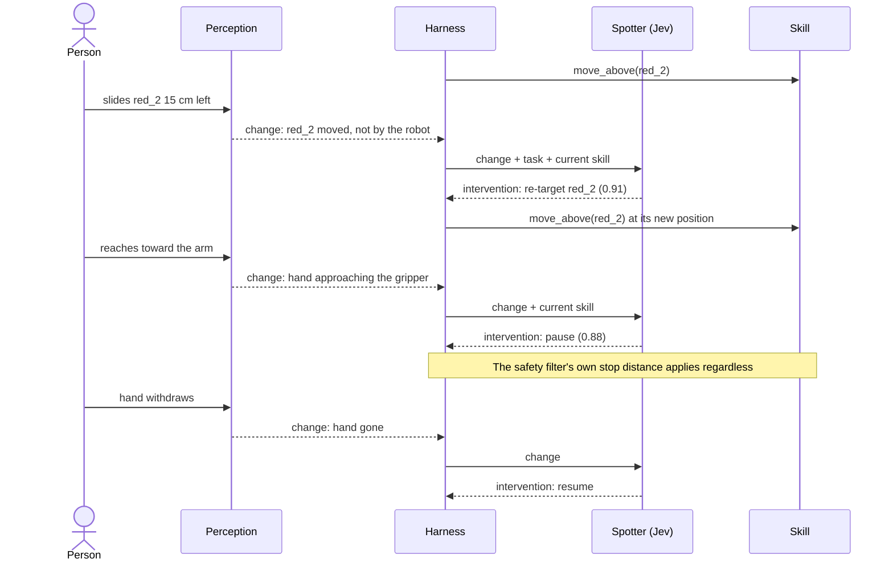
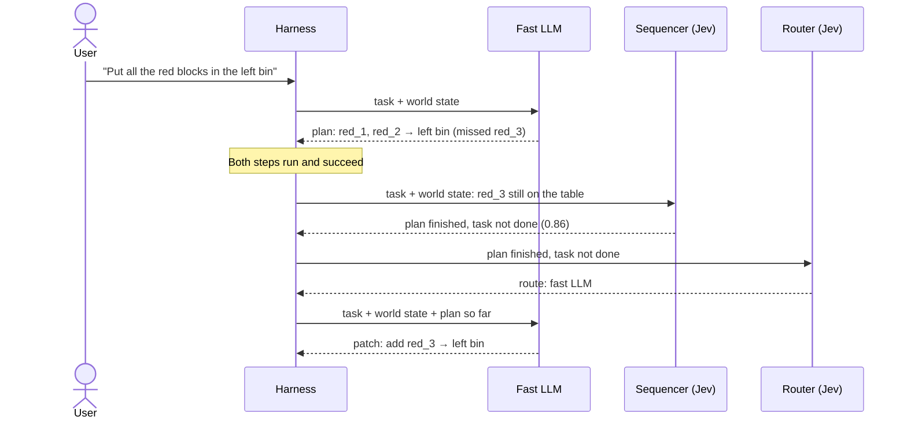
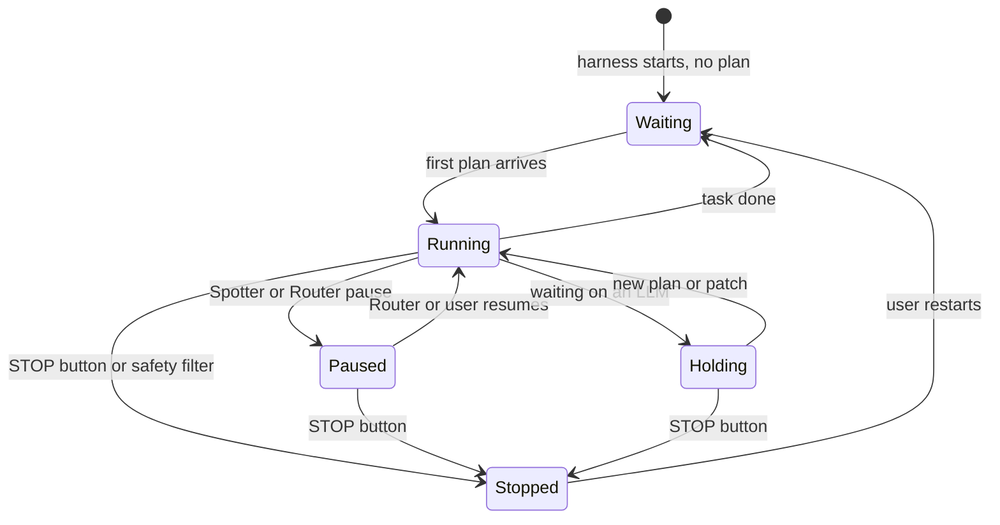

# v2 diagrams

Companion to `docs/v2.md`. GitHub renders these.

## 1. The loop

Perception, the user and skills put events on a bus. The harness takes each event, asks the right
layer (async), and applies the answer. Only the harness moves the arm, and perception sees the result.

## 2. Start-up and the normal cycle

Perception and the harness start first. With no plan, the harness asks the fast LLM for one; the
first skill runs as soon as it arrives, and everything after that is event-driven.

## 3. Headline demo: "actually, reverse it"

The task is "line the numbered blocks up in the tray, lowest on the left". The correction changes the
final arrangement, so the sort order parameter flips. The fast path acts within ~150 ms; only the
ambiguous part goes to the LLM, in parallel.

## 4. Walk: someone moves the target, then reaches in

Perception flags changes the robot didn't cause; the Spotter decides what each one means.

## 5. A plan that misses something

Nothing outside changed: the fast LLM's plan left out a block that was half hidden behind the bin.
The plan finishes, but checking against the task (not the plan) shows the task isn't done.

## 6. What the arm is doing

Only the harness moves the arm between these states. A model can pause it; only the STOP button or
the safety filter stops it.

